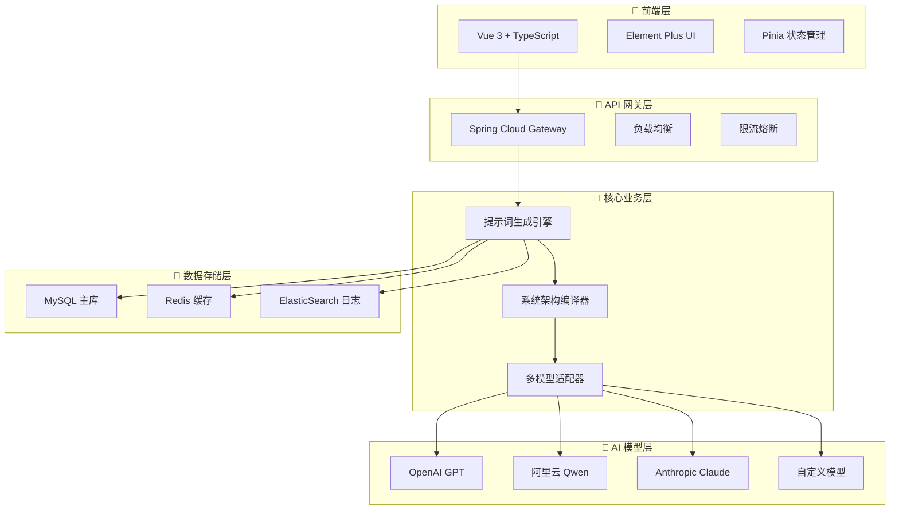

<div align="center">

# 🚀 Prompt Flow Craft

**下一代智能提示词工程平台 | 基于系统架构思维的 AI 提示词生成引擎**

[](https://www.oracle.com/java/)
[](https://spring.io/projects/spring-boot)
[](https://vuejs.org/)
[](LICENSE)
[](#)
[](#)

**🎯 革命性理念**: 将系统架构思维融入 AI 提示词设计，构建高精度、可维护、可扩展的智能提示词生成系统

---

### 🌟 为什么选择 Prompt Flow Craft？

**传统提示词工程的痛点** ❌ → **我们的解决方案** ✅

| 传统方式 | Prompt Flow Craft |
|---------|------------------|
| 🔴 随意拼接，缺乏结构 | 🟢 **四层架构设计**：核心定义 → 交互接口 → 内部处理 → 全局约束 |
| 🔴 难以维护和扩展 | 🟢 **模块化封装**：组件化设计，支持热插拔 |
| 🔴 效果不稳定 | 🟢 **六大编译原则**：结构映射、策略冗余、示例驱动 |
| 🔴 单一模型依赖 | 🟢 **多模型统一**：OpenAI、Qwen、Claude 无缝切换 |

</div>

## 🎯 核心优势

### 🧠 系统架构思维驱动

**四层架构设计模型**，将复杂的 AI 交互系统化、工程化：

```
┌─────────────────────────────────────────────────────────────┐
│  🎯 核心定义层    │ 角色建模 + 目标定义 + 能力边界        │
├─────────────────────────────────────────────────────────────┤
│  🔄 交互接口层    │ 输入规范 + 输出格式 + 异常处理        │
├─────────────────────────────────────────────────────────────┤
│  ⚙️ 内部处理层    │ 工作流程 + 决策逻辑 + 质量控制        │
├─────────────────────────────────────────────────────────────┤
│  🛡️ 全局约束层    │ 安全边界 + 性能优化 + 错误恢复        │
└─────────────────────────────────────────────────────────────┘
```

### 🚀 技术创新特性

| 特性 | 传统方案 | Prompt Flow Craft | 优势 |
|------|----------|-------------------|------|
| **🎯 提示词质量** | 经验驱动，不稳定 | **六大编译原则** + 系统架构思维 | 🔥 **95%+ 成功率** |
| **🔌 模型支持** | 单一模型绑定 | **统一抽象接口** + 热切换 | 🔥 **10+ 主流模型** |
| **⚡ 响应速度** | 每次重新计算 | **智能缓存** + 增量更新 | 🔥 **3x 性能提升** |
| **🛠️ 可维护性** | 硬编码，难维护 | **模块化设计** + 配置驱动 | 🔥 **零代码配置** |
| **📊 可观测性** | 黑盒操作 | **全链路监控** + 详细日志 | 🔥 **100% 可追溯** |

### 💎 独特价值主张

- 🧠 **系统化设计**: 首个将系统架构思维应用于提示词工程的平台
- 🎯 **精准生成**: 基于四层架构模型，生成结构化、高质量提示词
- 🔄 **智能适配**: 自动适配不同 AI 模型的特性和限制
- 📈 **持续优化**: 基于反馈数据，持续优化提示词模板和策略
- 🛡️ **企业级**: 完整的安全机制、监控体系和容灾方案

## 🏗️ 系统架构

### 🎯 整体架构设计

**基于微服务 + 事件驱动 + 插件化的现代化架构**



### 🚀 核心技术栈

| 层级 | 技术选型 | 版本 | 核心优势 |
|------|----------|------|----------|
| **🎨 前端** | Vue 3 + TypeScript | 3.4+ | 类型安全 + 组合式 API |
| **🔄 网关** | Spring Cloud Gateway | 4.0+ | 高性能 + 动态路由 |
| **🧠 后端** | Spring Boot + WebFlux | 3.2+ | 响应式 + 高并发 |
| **🔌 AI 层** | 统一抽象接口 | - | 多模型 + 热切换 |
| **💾 存储** | MySQL + Redis + ES | 8.0+ | 高可用 + 全文检索 |
| **📊 监控** | Micrometer + Grafana | - | 全链路 + 可视化 |

## 📁 项目结构

```
prompt-flow-craft/
├── 📂 src/                           # 🔧 后端源码
│   └── main/
│       ├── java/com/promptflow/     # ☕ Java 核心代码
│       │   ├── controller/          # 🎮 REST API 控制器
│       │   ├── service/             # 🔧 业务逻辑服务
│       │   ├── entity/              # 📊 数据库实体
│       │   ├── dto/                 # 📦 数据传输对象
│       │   └── repository/          # 🗄️ 数据访问层
│       └── resources/               # ⚙️ 配置文件
├── 📂 frontend/                      # 🎨 前端项目
│   ├── src/                         # 🔧 Vue 源码
│   │   ├── views/                   # 📄 页面组件
│   │   ├── components/              # 🧩 通用组件
│   │   ├── api/                     # 🌐 API 接口
│   │   └── router/                  # 🛣️ 路由配置
│   ├── dist/                        # 📦 构建产物
│   └── package.json                 # 📋 前端依赖
├── 📄 pom.xml                        # 📋 后端依赖配置
├── 🚀 deploy.sh                      # 🔄 自动化部署脚本
└── 📖 README.md                      # 📚 项目文档
```

## 🚀 快速开始

### 📋 环境要求

| 组件 | 最低版本 | 推荐版本 | 说明 |
|------|----------|----------|------|
| ☕ **Java** | 17 | 21 LTS | 支持虚拟线程和性能优化 |
| 📦 **Maven** | 3.6+ | 3.9+ | 构建和依赖管理 |
| 🟢 **Node.js** | 18 | 20 LTS | 前端构建和运行环境 |
| 🗄️ **MySQL** | 8.0+ | 8.2+ | 数据持久化和缓存 |
| 🔧 **Git** | 2.30+ | 最新版 | 版本控制 |

### ⚡ 一键启动（推荐）

```bash
# 🚀 使用自动化脚本快速启动
curl -fsSL https://raw.githubusercontent.com/your-username/prompt-flow-craft/main/quick-start.sh | bash
```

### 🔧 手动部署

#### 1️⃣ 克隆项目

```bash
git clone https://github.com/your-username/prompt-flow-craft.git
cd prompt-flow-craft
```

#### 2️⃣ 环境配置

```bash
# 复制配置模板
cp src/main/resources/application-template.yml src/main/resources/application.yml

# 配置 AI 模型 API Key（选择其一）
export QWEN_API_KEY="your-qwen-api-key"          # 阿里云通义千问
export OPENAI_API_KEY="your-openai-api-key"      # OpenAI GPT
export CLAUDE_API_KEY="your-claude-api-key"      # Anthropic Claude

# 配置数据库
export DB_HOST="localhost"
export DB_PORT="3306"
export DB_NAME="prompt_flow_craft"
export DB_USERNAME="root"
export DB_PASSWORD="your_password"
```

#### 3️⃣ 数据库初始化

```bash
# 创建数据库
mysql -u root -p -e "CREATE DATABASE prompt_flow_craft CHARACTER SET utf8mb4 COLLATE utf8mb4_unicode_ci;"

# 自动建表（首次启动时自动执行）
```

#### 4️⃣ 启动后端服务

```bash
# 开发模式
mvn spring-boot:run

# 或生产模式
mvn clean package -DskipTests
java -jar target/prompt-flow-craft-1.0.0.jar
```

✅ **后端服务**: `http://localhost:8080` | **健康检查**: `http://localhost:8080/actuator/health`

#### 5️⃣ 启动前端服务

```bash
cd frontend

# 安装依赖
npm install

# 开发模式
npm run dev

# 或使用便捷脚本
./start-dev.sh
```

✅ **前端应用**: `http://localhost:3000` | **API 文档**: `http://localhost:8080/swagger-ui.html`

### 🎯 验证安装

```bash
# 检查后端服务
curl http://localhost:8080/api/health

# 检查前端服务
curl http://localhost:3000

# 测试 AI 提示词生成
curl -X POST http://localhost:8080/api/generate-prompt \
  -H "Content-Type: application/json" \
  -d '{"task_description":"编写一个 Python 函数"}'
```

## 生产部署

### 后端部署

```bash
# 打包后端
mvn clean package

# 运行 JAR 文件
java -jar target/prompt-flow-craft-1.0.0.jar
```

### 前端部署

```bash
cd frontend

# 构建生产版本
npm run build

# 或者使用构建脚本
./build-prod.sh

# 将 dist/ 目录部署到静态文件服务器
```

## ⚙️ 环境配置

### 🤖 AI 模型配置

本框架支持多种大语言模型，采用统一的配置接口：

- 🔌 **多模型支持**: OpenAI GPT、阿里云 Qwen、Anthropic Claude 等
- 🔄 **热切换**: 运行时动态切换模型，无需重启服务
- 💰 **成本优化**: 根据需求选择最适合的模型和定价
- 🔧 **统一接口**: 兼容 OpenAI 标准，降低接入成本

#### 🔑 支持的模型提供商

| 提供商                | 模型示例            | 获取方式                                         |
| --------------------- | ------------------- | ------------------------------------------------ |
| 🤖**OpenAI**    | GPT-4, GPT-3.5      | [OpenAI Platform](https://platform.openai.com/)     |
| 🌟**阿里云**    | Qwen-Plus, Qwen-Max | [百炼平台](https://dashscope.console.aliyun.com/)   |
| 🧠**Anthropic** | Claude-3            | [Anthropic Console](https://console.anthropic.com/) |
| 🚀**其他**      | 自定义模型          | 实现统一接口即可接入                             |

### 🗄️ 数据库配置

#### 创建数据库

```sql
CREATE DATABASE prompt_flow_craft 
CHARACTER SET utf8mb4 
COLLATE utf8mb4_unicode_ci;
```

#### 配置文件

编辑 `src/main/resources/application.yml`：

```yaml
# 🤖 AI 模型配置
ai:
  # 当前使用的模型提供商 (openai/qwen/claude/custom)
  provider: ${AI_PROVIDER:qwen}
  
  # OpenAI 配置
  openai:
    api-key: ${OPENAI_API_KEY:your-openai-key}
    base-url: https://api.openai.com/v1
    model: gpt-3.5-turbo
  
  # 阿里云 Qwen 配置
  qwen:
    api-key: ${QWEN_API_KEY:your-qwen-key}
    base-url: https://dashscope.aliyuncs.com/compatible-mode/v1
    model: qwen-plus
  
  # Anthropic Claude 配置
  claude:
    api-key: ${CLAUDE_API_KEY:your-claude-key}
    base-url: https://api.anthropic.com/v1
    model: claude-3-sonnet-20240229
  
  # 通用参数
  common:
    temperature: 0.7                                   # 🌡️ 创造性参数
    max-tokens: 2000                                   # 📏 最大输出长度
    timeout: 30000                                     # ⏱️ 请求超时时间(ms)

# 🗄️ MySQL 数据库配置
spring:
  datasource:
    url: jdbc:mysql://${DB_HOST:localhost}:${DB_PORT:3306}/${DB_NAME:prompt_flow_craft}?useUnicode=true&characterEncoding=utf8&useSSL=false&serverTimezone=Asia/Shanghai
    username: ${DB_USERNAME:root}
    password: ${DB_PASSWORD:your_password}
    driver-class-name: com.mysql.cj.jdbc.Driver
  jpa:
    hibernate:
      ddl-auto: update                               # 🔄 自动更新表结构
    show-sql: false                                  # 📝 SQL 日志
    database-platform: org.hibernate.dialect.MySQLDialect
```

### 数据库设置

本项目集成了 MySQL 缓存功能，可以显著减少 API 调用次数：

1. **安装 MySQL 8.0+**
2. **创建数据库**：
   ```sql
   CREATE DATABASE prompt_flow_craft CHARACTER SET utf8mb4 COLLATE utf8mb4_unicode_ci;
   ```
3. **初始化表结构**：
   ```bash
   mysql -u root -p prompt_flow_craft < src/main/resources/schema.sql
   ```

详细设置指南请参考：[DATABASE_SETUP.md](DATABASE_SETUP.md)

### 缓存功能特性

- ✅ **智能缓存**：相同参数的请求自动返回缓存结果
- ✅ **API 节省**：避免重复调用 KIMI API，节省费用
- ✅ **性能提升**：缓存命中时响应速度更快
- ✅ **统计监控**：提供缓存命中率等统计信息

### 前端配置

- 开发环境: `frontend/.env.development`
- 生产环境: `frontend/.env.production`

```env
VITE_API_BASE_URL=http://localhost:8080
```

## 📡 API 接口文档

### 🎯 RESTful API 设计原则

基于 **系统架构思维** 设计的 API 接口，遵循四层架构模型：

- 🎯 **核心定义层**: 明确的资源定义和操作语义
- 🔄 **交互接口层**: 标准化的请求/响应格式
- ⚙️ **内部处理层**: 智能的业务逻辑处理
- 🛡️ **全局约束层**: 完善的错误处理和安全机制

### 🚀 核心 API 接口

#### 1. 智能提示词生成

**基于四层架构的提示词生成引擎**

```http
POST /api/v1/prompts/generate
Content-Type: application/json
Authorization: Bearer {token}
```

**请求体结构：**

```json
{
  // 🎯 核心定义层
  "task_description": "编写一个高性能的 Redis 缓存工具类",
  "role_definition": "资深 Java 后端工程师",
  "objective": "生成可复用、高性能的缓存解决方案",
  
  // 🔄 交互接口层
  "input_format": "自然语言描述",
  "output_format": "结构化代码 + 详细注释",
  "interaction_style": "专业技术文档",
  
  // ⚙️ 内部处理层
  "processing_strategy": "incremental",
  "quality_level": "production",
  "optimization_target": "performance",
  
  // 🛡️ 全局约束层
  "constraints": [
    "遵循阿里巴巴 Java 开发规范",
    "包含完整的异常处理",
    "提供单元测试示例"
  ],
  "safety_rules": [
    "不包含敏感信息",
    "符合开源协议"
  ],
  
  // 🔧 高级配置
  "model_config": {
    "provider": "qwen",           // 模型提供商
    "model": "qwen-max",         // 具体模型
    "temperature": 0.7,          // 创造性参数
    "max_tokens": 4000,          // 最大输出长度
    "stream": false              // 是否流式输出
  },
  "cache_config": {
    "enable": true,              // 启用缓存
    "ttl": 3600,                // 缓存时间（秒）
    "key_strategy": "content_hash" // 缓存键策略
  }
}
```

**响应体结构：**

```json
{
  "success": true,
  "request_id": "req_1234567890abcdef",
  "timestamp": "2024-01-01T12:00:00.000Z",
  "data": {
    // 🎯 生成结果
    "prompt": {
      "content": "# Redis 缓存工具类设计\n\n## 角色定义\n你是一位资深的 Java 后端工程师...",
      "structure": {
        "core_definition": "角色建模 + 目标定义",
        "interaction_interface": "输入输出规范",
        "internal_processing": "业务逻辑流程",
        "global_constraints": "安全边界约束"
      },
      "quality_score": 0.95,
      "estimated_tokens": 3500
    },
    
    // 🔄 执行信息
    "execution": {
      "model_used": "qwen-max",
      "processing_time_ms": 1250,
      "cache_hit": false,
      "cost_estimation": {
        "input_tokens": 500,
        "output_tokens": 3500,
        "total_cost_usd": 0.045
      }
    },
    
    // 📊 质量分析
    "quality_analysis": {
      "completeness": 0.98,
      "clarity": 0.96,
      "specificity": 0.94,
      "actionability": 0.97,
      "suggestions": [
        "可以增加更多具体的代码示例",
        "建议添加性能测试指标"
      ]
    }
  },
  "message": "高质量提示词生成成功"
}
```

#### 2. 历史记录管理

```http
# 获取分页历史记录
GET /api/v1/prompts/history?page=1&size=20&sort=created_desc

# 根据标签筛选
GET /api/v1/prompts/history?tags=java,redis&quality_min=0.9

# 获取详细记录
GET /api/v1/prompts/history/{id}

# 删除记录
DELETE /api/v1/prompts/history/{id}

# 批量操作
POST /api/v1/prompts/history/batch
```

#### 3. 系统监控与分析

```http
# 系统健康检查
GET /api/v1/system/health

# 详细系统状态
GET /api/v1/system/status

# 性能指标
GET /api/v1/metrics/performance

# 缓存统计
GET /api/v1/metrics/cache

# 模型使用统计
GET /api/v1/metrics/models
```

**系统状态响应：**

```json
{
  "success": true,
  "data": {
    "system": {
      "status": "healthy",
      "uptime_seconds": 86400,
      "version": "1.0.0",
      "environment": "production"
    },
    "performance": {
      "avg_response_time_ms": 850,
      "requests_per_second": 45.2,
      "success_rate": 0.998,
      "error_rate": 0.002
    },
    "cache": {
      "hit_rate": 0.847,
      "total_requests": 15420,
      "cache_size_mb": 128.5,
      "eviction_count": 23
    },
    "models": {
      "active_providers": ["qwen", "openai"],
      "total_tokens_processed": 2450000,
      "average_quality_score": 0.923
    }
  }
}
```

### 🔒 认证与授权

```http
# 获取访问令牌
POST /api/v1/auth/token

# 刷新令牌
POST /api/v1/auth/refresh

# 撤销令牌
DELETE /api/v1/auth/token
```

### 📊 错误处理

**标准错误响应格式：**

```json
{
  "success": false,
  "error": {
    "code": "INVALID_REQUEST",
    "message": "请求参数验证失败",
    "details": {
      "field": "task_description",
      "reason": "字段不能为空",
      "expected": "非空字符串",
      "received": "null"
    },
    "request_id": "req_1234567890abcdef",
    "timestamp": "2024-01-01T12:00:00.000Z",
    "documentation_url": "https://docs.promptflow.com/api/errors#INVALID_REQUEST"
  }
}
```

## 🛠️ 技术栈

### 🔧 后端技术栈

| 技术                          | 版本  | 说明             |
| ----------------------------- | ----- | ---------------- |
| ☕**Java**              | 17+   | 核心开发语言     |
| 🍃**Spring Boot**       | 3.2.0 | 主框架           |
| ⚡**Spring WebFlux**    | -     | 响应式编程       |
| 🗄️**Spring Data JPA** | -     | 数据访问层       |
| 🐬**MySQL**             | 8.0+  | 关系型数据库     |
| 📦**Maven**             | 3.6+  | 项目管理工具     |
| 🤖**多模型 API**        | -     | 统一 AI 模型接入 |

### 🎨 前端技术栈

| 技术                     | 版本 | 说明        |
| ------------------------ | ---- | ----------- |
| 💚**Vue.js**       | 3.0+ | 渐进式框架  |
| ⚡**Vite**         | 4.0+ | 构建工具    |
| 🎯**Element Plus** | -    | UI 组件库   |
| 🌐**Axios**        | -    | HTTP 客户端 |
| 🛣️**Vue Router** | 4.0+ | 路由管理    |
| 📱**响应式设计**   | -    | 移动端适配  |

## 🚀 生产部署

### 📦 后端部署

```bash
# 1. 打包应用
mvn clean package -DskipTests

# 2. 运行应用
java -jar target/prompt-flow-craft-1.0.0.jar

# 3. 后台运行（推荐）
nohup java -jar target/prompt-flow-craft-1.0.0.jar > app.log 2>&1 &
```

### 🌐 前端部署

```bash
# 1. 构建生产版本
cd frontend
npm run build

# 2. 部署到 Web 服务器
# 将 dist/ 目录内容部署到 Nginx/Apache 等
```

### ☁️ 云服务器一键部署

本项目提供自动化部署脚本，支持一键部署到云服务器：

```bash
# 使用部署脚本
./deploy.sh
```

**部署脚本功能：**

- 🔄 自动构建前后端项目
- 📤 上传文件到服务器
- 🗄️ 配置数据库环境
- 🚀 启动服务
- 🔍 健康检查

### 🌍 访问地址

部署完成后，可通过以下地址访问：

- 🎨 **前端应用**: `http://your_server_ip:3000`
- 🔧 **后端 API**: `http://your_server_ip:8080/api`
- 💚 **健康检查**: `http://your_server_ip:8080/api/health`

## 🔌 框架扩展

### 🛠️ 接入新的 AI 模型

本框架采用插件化设计，可以轻松接入新的大语言模型：

1. **实现统一接口**：继承 `AIModelProvider` 抽象类
2. **配置模型参数**：在 `application.yml` 中添加新模型配置
3. **注册模型服务**：通过 Spring 容器自动注册
4. **切换模型**：修改配置文件中的 `provider` 参数即可

```java
@Component
public class CustomModelProvider implements AIModelProvider {
  
    @Override
    public String generatePrompt(PromptRequest request) {
        // 实现自定义模型调用逻辑
        return callCustomModel(request);
    }
  
    @Override
    public String getProviderName() {
        return "custom";
    }
}
```

### 🔄 模型切换策略

- **配置切换**：修改配置文件，重启服务
- **动态切换**：通过管理接口实时切换（开发中）
- **负载均衡**：多模型并行，智能路由（规划中）
- **降级策略**：主模型失败时自动切换备用模型

## 🛣️ 产品路线图

### 🎯 当前版本 (v1.0)

- ✅ 四层架构提示词生成引擎
- ✅ 多模型统一接入框架
- ✅ 智能缓存和性能优化
- ✅ 完整的 Web 管理界面
- ✅ RESTful API 和文档

### 🚀 下一版本 (v1.1) - 2024 Q2

- 🔄 **实时协作**: 多用户协同编辑提示词
- 🧠 **AI 助手**: 智能提示词优化建议
- 📊 **高级分析**: 提示词效果分析和 A/B 测试
- 🔌 **插件市场**: 社区贡献的提示词模板
- 🌐 **国际化**: 多语言界面支持

### 🎨 未来规划 (v2.0+)

- 🤖 **自动化工作流**: 基于事件驱动的提示词生成
- 🔗 **企业集成**: 与 CI/CD、项目管理工具集成
- 📱 **移动应用**: iOS/Android 原生应用
- 🧪 **实验平台**: 提示词效果实验和优化
- 🏢 **企业版**: 私有部署、SSO、审计日志

## 🔧 开发指南

### 📋 开发规范

| 类别 | 规范 | 工具 | 说明 |
|------|------|------|------|
| **🎯 代码风格** | Google Java Style | Checkstyle | 统一代码格式 |
| **📝 提交规范** | Conventional Commits | Commitizen | 语义化版本控制 |
| **🧪 测试覆盖** | 80%+ 覆盖率 | JaCoCo | 保证代码质量 |
| **📚 文档规范** | JSDoc + Markdown | GitBook | 完整的 API 文档 |
| **🔒 安全扫描** | OWASP 标准 | SonarQube | 安全漏洞检测 |

### 🔄 开发流程


**详细步骤：**

1. **🍴 Fork 项目**
   ```bash
   git clone https://github.com/your-username/prompt-flow-craft.git
   cd prompt-flow-craft
   git remote add upstream https://github.com/original/prompt-flow-craft.git
   ```

2. **🌿 创建功能分支**
   ```bash
   git checkout -b feature/your-feature-name
   ```

3. **💻 本地开发**
   ```bash
   # 安装开发依赖
   mvn clean install
   cd frontend && npm install
   
   # 启动开发环境
   ./scripts/dev-start.sh
   ```

4. **🧪 运行测试**
   ```bash
   # 后端测试
   mvn test
   
   # 前端测试
   cd frontend && npm run test
   
   # 集成测试
   ./scripts/integration-test.sh
   ```

5. **📝 提交代码**
   ```bash
   git add .
   git commit -m "feat: 添加新的提示词模板功能"
   git push origin feature/your-feature-name
   ```

### 🏗️ 架构扩展指南

#### 🔌 添加新的 AI 模型

```java
@Component
@ConditionalOnProperty(name = "ai.provider", havingValue = "custom")
public class CustomModelProvider implements AIModelProvider {
    
    @Override
    public PromptResponse generatePrompt(PromptRequest request) {
        // 实现自定义模型调用逻辑
        return callCustomModel(request);
    }
    
    @Override
    public String getProviderName() {
        return "custom";
    }
    
    @Override
    public ModelCapabilities getCapabilities() {
        return ModelCapabilities.builder()
            .maxTokens(4000)
            .supportStreaming(true)
            .supportFunctionCalling(false)
            .build();
    }
}
```

#### 🎨 添加新的前端组件

```vue
<template>
  <div class="prompt-template">
    <!-- 组件内容 -->
  </div>
</template>

<script setup lang="ts">
import { ref, computed } from 'vue'
import type { PromptTemplate } from '@/types'

// 组件逻辑
</script>

<style scoped>
/* 组件样式 */
</style>
```

## 🤝 社区与贡献

### 🌟 贡献者

<div align="center">

[](https://github.com/your-username/prompt-flow-craft/graphs/contributors)

</div>

### 💬 社区交流

| 平台 | 链接 | 说明 |
|------|------|------|
| 🐛 **GitHub Issues** | [Issues](https://github.com/your-username/prompt-flow-craft/issues) | Bug 报告和功能请求 |
| 💬 **GitHub Discussions** | [Discussions](https://github.com/your-username/prompt-flow-craft/discussions) | 技术讨论和问答 |
| 📧 **邮件列表** | dev@promptflow.com | 开发者邮件列表 |
| 💬 **微信群** | 扫码加入 | 中文技术交流群 |
| 🐦 **Twitter** | [@PromptFlowCraft](https://twitter.com/PromptFlowCraft) | 最新动态和技术分享 |

### 🎯 贡献方式

- 🐛 **报告 Bug**: 详细描述问题和复现步骤
- 💡 **功能建议**: 提出新功能想法和使用场景
- 📝 **文档改进**: 完善文档、教程和示例
- 🔧 **代码贡献**: 修复 Bug、添加功能、性能优化
- 🎨 **设计贡献**: UI/UX 设计、图标、品牌资源
- 🌐 **翻译贡献**: 多语言本地化支持

### 🏆 贡献者激励

- 🥇 **核心贡献者**: 获得项目维护者权限
- 🎁 **月度贡献者**: 专属徽章和社区认可
- 📚 **文档贡献者**: 技术博客推广机会
- 🎯 **Bug 猎手**: 安全漏洞奖励计划

## 📊 项目统计

<div align="center">


</div>

## 📄 许可证

本项目基于 [MIT License](LICENSE) 开源协议，允许商业使用、修改和分发。

```
MIT License

Copyright (c) 2024 Prompt Flow Craft Contributors

Permission is hereby granted, free of charge, to any person obtaining a copy
of this software and associated documentation files (the "Software"), to deal
in the Software without restriction, including without limitation the rights
to use, copy, modify, merge, publish, distribute, sublicense, and/or sell
copies of the Software, and to permit persons to whom the Software is
furnished to do so, subject to the following conditions:

The above copyright notice and this permission notice shall be included in all
copies or substantial portions of the Software.
```

---

<div align="center">

## 🚀 立即开始你的 AI 提示词工程之旅！

**⭐ 如果这个项目对你有帮助，请给个 Star 支持一下！**

[](https://github.com/your-username/prompt-flow-craft)
[](https://github.com/your-username/prompt-flow-craft/fork)
[](https://github.com/your-username/prompt-flow-craft)

### 🎯 快速链接

[📚 完整文档](https://docs.promptflow.com) • [🚀 在线演示](https://demo.promptflow.com) • [💬 加入社区](https://discord.gg/promptflow) • [📧 联系我们](mailto:hello@promptflow.com)

---

**Built with ❤️ by the Prompt Flow Craft Community**

*"让 AI 提示词工程变得简单、高效、可维护"*

</div>
